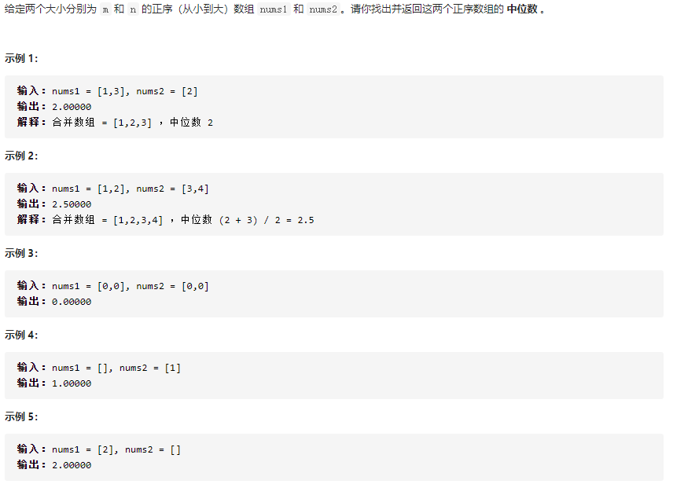

## 4. 寻找两个正序数组的中位数:star::star:



```c++
class Solution {
public:
    double findMedianSortedArrays(vector<int>& nums1, vector<int>& nums2) {
        int m = (nums1.size() + nums2.size()) / 2;
		int n = (nums1.size() + nums2.size()) % 2;
		int a = 0, b = 0;
		double x = 0, y = INT_MAX;
		for (int i = 0;i <= m;i++)
		{
			if (a < nums1.size())
			{
				x = y;
				y = nums1[a];
				a++;
			}
			if (b < nums2.size())
			{
				if (a > nums1.size())
				{
					x = y;
					y = nums2[b];
					b++;
				}
				else if (nums2[b] < y)
				{
					y = nums2[b];
					b++;
					a--;
				}
			}
            if (a == nums1.size())a++;
		}
		if (n == 1)return y;
		return (x + y) / 2;
    }
};
```

核心思路：遍历，然后获取中位数。