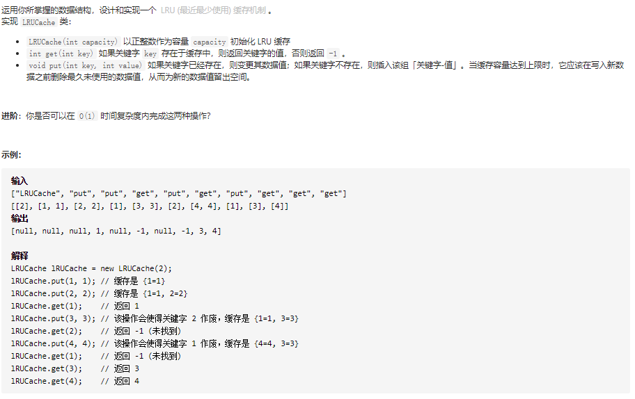
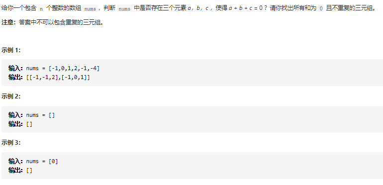
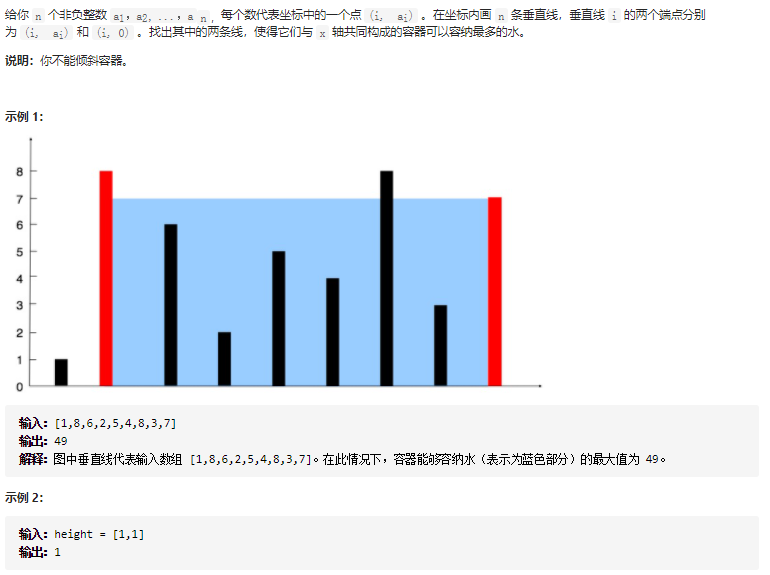
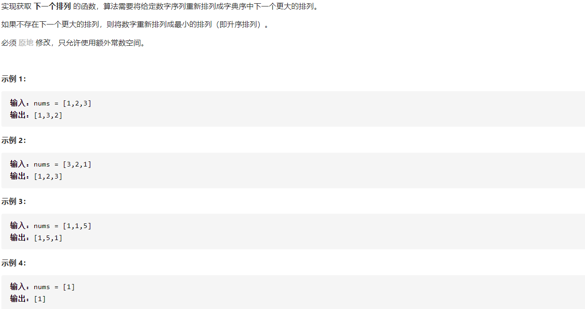

## 146 LRU缓冲机制:star::star:



```c++
class LRUCache {
public:
	map<int, array<int, 2>> cache;
	int cap = 0;
	LRUCache(int capacity) {
		cap = capacity;
	}

	int get(int key) {
		if (cache.find(key) == cache.end())
			return -1;
		for (auto it = cache.begin(); it != cache.end(); it++)
			it->second[1]++;
		cache[key][1] = -1;
		return cache[key][0];
	}

	void put(int key, int value) {
		int key2 = 0, max = -2;
		for (auto it = cache.begin(); it != cache.end(); it++)
		{
			if (it->second[1] > max)
			{
				max = it->second[1];
				key2 = it->first;
			}
			it->second[1]++;
		}
		cache[key] = { value,-1};
		if (cache.size() > cap)
		{
			cache.erase(key2);
		}
	}
};
```

核心思路：使用`map`


## 15. 三数之和:star::star:❓️



```c++
class Solution {
public:
    vector<vector<int>> threeSum(vector<int>& nums) {
        int n = nums.size();
        sort(nums.begin(), nums.end());
        vector<vector<int>> ans;
        // 枚举 a
        for (int first = 0; first < n; ++first) {
            // 需要和上一次枚举的数不相同
            if (first > 0 && nums[first] == nums[first - 1]) {
                continue;
            }
            // c 对应的指针初始指向数组的最右端
            int third = n - 1;
            int target = -nums[first];
            // 枚举 b
            for (int second = first + 1; second < n; ++second) {
                // 需要和上一次枚举的数不相同
                if (second > first + 1 && nums[second] == nums[second - 1]) {
                    continue;
                }
                // 需要保证 b 的指针在 c 的指针的左侧
                while (second < third && nums[second] + nums[third] > target) {
                    --third;
                }
                // 如果指针重合，随着 b 后续的增加
                // 就不会有满足 a+b+c=0 并且 b<c 的 c 了，可以退出循环
                if (second == third) {
                    break;
                }
                if (nums[second] + nums[third] == target) {
                    ans.push_back({nums[first], nums[second], nums[third]});
                }
            }
        }
        return ans;
    }
};
```

核心思路：见注释


## 11. 盛最多水的容器:star::star:



```c++
class Solution {
public:
    int maxArea(vector<int>& height) {
        int max = 0;
		int temp = 0;
		for(int i=0;i<height.size()-1;i++)
			for (int j = height.size() - 1;j > i;j--)
			{
                temp = (j - i) * height[i];
                if(temp < max)break;
				if (height[j] >= height[i])
				{
					max = max > temp ? max : temp;
					break;
				}
			}

		for(int i=height.size()-1;i>0;i--)
			for (int j = 0;j < i;j++)
			{
                temp = (i - j) * height[i];
                if(temp < max)break;
				if (height[j] > height[i])
				{
					max = max > temp ? max : temp;
					break;
				}
			}
		
		return max;
    }
};
```

核心思路：仍然是两遍循环的思路。


## 31. 下一个排列——字典序:star::star:



```c++
void Swap(int& a, int& b)
{
    int temp = a;
    a = b;
    b = temp;
}
class Solution {
public:
    void nextPermutation(vector<int>& nums) {
        if(nums.size() == 1)return;
        int pos = -1;
		for (int i = nums.size() -1 ;i > 0;i--)
		{
			if (nums[i] > nums[i - 1])
			{
				pos = i - 1;
				break;
			}
		}
        
        if(pos == -1)
        {
            sort(nums.begin(),nums.end());
            return;
        }

		for(int i=nums.size()-1;i>pos;i--)
		{
			if (nums[i] > nums[pos]) {
				Swap(nums[pos], nums[i]);
				break;
			}
		}
		sort(nums.begin() + pos + 1, nums.end());
    }
};
```

核心思路：从尾开始遍历，找到第一个$a[i-1]<a[i]$的位置，交换`尾部至i`中第一个大于`a[i-1]`的位置，交换这两个位置的元素，然后对`尾部至i`这段区域进行升序排序。