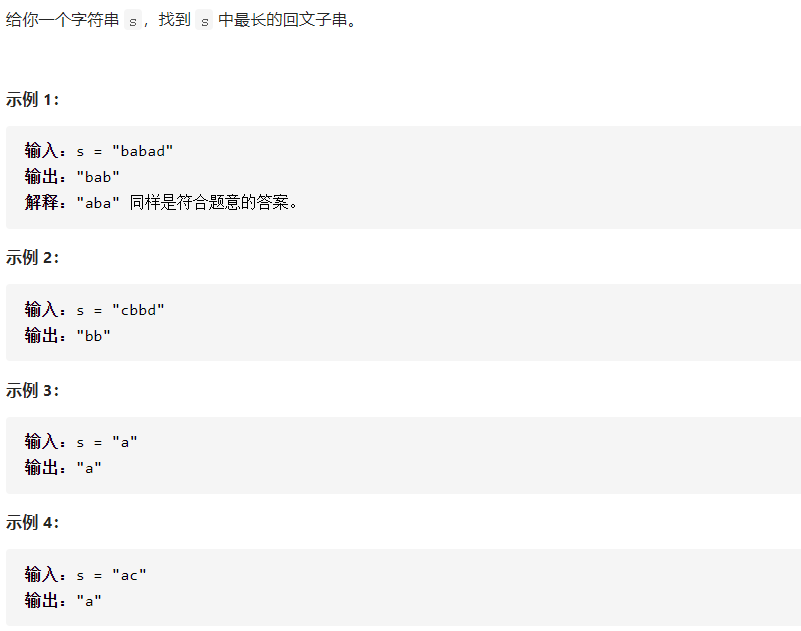

## 368 最大整除子集:star::star:


```c++
bool Cmp2(const int& a, const int& b)
{
    return a < b;
}

class Solution {
public:
    vector<int> largestDivisibleSubset(vector<int>& nums) {
        if(nums.size() <= 1)return nums;

        vector<int> dp(nums.size(), 1);
        vector<int> pos(nums.size(), 0);

        sort(nums.begin(), nums.end(), Cmp2);

        for (int i = 0;i < nums.size();i++)
        {
            pos[i] = i;
        }
        
        for (int i = 1;i < nums.size();i++)
        {
            for (int j = i - 1;j >= 0;j--)
            {
                if (nums[i] % nums[j] == 0 && dp[j] + 1 > dp[i])
                {
                    dp[i] = dp[j] + 1;
                    pos[i] = j;
                }
            }
        }

        int p = 0;
        int max = -1;
        for (int i = 0;i < nums.size();i++)
        {
            if (dp[i] > max)
            {
                p = i;
                max = dp[i];
            }
        }

        vector<int> result;

        do {
            result.push_back(nums[p]);
            p = pos[p];
        }
        while (result[result.size() - 1] != nums[p]);

        reverse(result.begin(), result.end());

        return result;
    }
    
};
```

核心思路：简历两个递归数组dp和pos，分别记录最大成员数和相应的上一个成员的位置，每次对于dp[i]，从`i-1`到0遍历一次，找到最佳情况。


## 375 猜数字大小II:star::star:❓️


```
#define max(a,b) (((a) > (b)) ? (a) : (b))
#define min(a,b) (((a) < (b)) ? (a) : (b))
class Solution {
public:
    int getMoneyAmount(int n) {
        if (n <= 3)return n - 1;
        vector<vector<int>> dp(n + 2, vector<int>());

        for(int i = 0;i < n + 2; i++)
        {
            dp[i].resize(n + 2);
        }

        for(int i = n;i >= 1; --i)
        {
            for(int j = i;j <= n; ++j)
            {
                if(i == j)
                    dp[i][j] = 0;
                else{
                    dp[i][j]=INT_MAX;
                    for(int x = i;x <= j; ++x)
                    {
                        dp[i][j] = min(dp[i][j], max(dp[i][x-1],dp[x+1][j]) + x);
                    }
                }
            }
        }
        
        return dp[1][n];
    }
};
```

核心思路：
$$
dp[i][j]表示从[i,j]中猜出正确数字所需要的最少花费金额.(dp[i][i] = 0) \\
 假设在范围[i,j]中选择x, 则选择x的最少花费金额为: max(dp[i][x-1], dp[x+1][j]) + x \\
 用max的原因是我们要计算最坏反馈情况下的最少花费金额(选了x之后, 正确数字落在花费更高的那侧) \\

初始化为(n+2)*(n+2)数组的原因: 处理边界情况更加容易, 例如对于求解dp[1][n]时x如果等于1, \\需要考虑dp[0][1](0不可能出现, dp[0][n]为0)
而当x等于n时, \\需要考虑dp[n+1][n+1](n+1也不可能出现, dp[n+1][n+1]为0)\\

如何写出相应的代码更新dp矩阵, 递推式dp[i][j] = max(max(dp[i][x-1], dp[x+1][j]) + x), \\x~[i:j], 可以画出矩阵图协助理解, 可以发现
dp[i][x-1]始终在dp[i][j]的左部,\\ dp[x+1][j]始终在dp[i][j]的下部, 所以更新dp矩阵时i的次序应当遵循bottom到top的规则, j则相反, 
\\由于
i肯定小于等于j, 所以我们只需要遍历更新矩阵的一半即可(下半矩阵)
$$


## 376 组数总和IV:star::star:


```
class Solution {
public:
    
    int combinationSum4(vector<int>& nums, int target) {
        if (nums.size() == 0)return 0;
        vector<double> dp(target + 1, 0);

        for (int i = 0;i < nums.size();i++)
        {
            if(nums[i] <= target)dp[nums[i]] = 1;
        }

        for (int i = 0;i <= target;i++)
        {
            for (int j = 0;j < nums.size();j++)
            {
                if (i - nums[j] >= 0)
                {
                    dp[i] += dp[i - nums[j]];
                }
            }
        }
        return (int)dp[target];
    }    
};
```

核心思路：对于数组nums，规划方程为：$dp[i]+=dp[i-nums[j]]$。


## 5 最长回文子串:star::star:



```c++
class Solution {
public:
    string longestPalindrome(string s) {
        if (s.size() <= 1)return s;

		vector<vector<int>> dp(s.length(), vector<int>());
		for (int i = 0;i < s.length();i++)
		{
			dp[i].resize(s.length());
			dp[i][i] = 1;
		}

		int L=0, R=0;
		int max = 1;

		for (int i = 1;i < s.length();i++)
		{
			for (int j = i - 1;j >= 0;j--)
			{
				if (s[i] == s[j])
				{
					if (i - 1 < j + 1 || dp[i - 1][j + 1])
					{
						dp[i][j] = 1;
						if (max < i - j + 1)
						{
							max = i - j + 1;
							L = j;
							R = i;
						}
					}
				}
			}
		}
		return s.substr(L, max);
    }
};
```

核心思路：外层循环$i:1\rightarrow n-1$，内层循环$j:i-1\rightarrow 0$，如果$s[i]==s[j]$，则继续判断$dp[i-1][j+1]$，如果符合，则置$dp[i][j]=1$，在更新dp的循环过程中，记录满足回文的最大长度，以及起点。
$$
dp[i][j]=(s[i]==s[j]) \&(dp[i-1][j+1]||(i-1<j+1))
$$


## 62 不同路径:star::star:


```c++
class Solution {
public:
    int uniquePaths(int m, int n) {
        vector<vector<int>> dp(m + 1, vector<int>(n + 1, 0));
		dp[1][0] = 1;

		for (int i = 1;i <= m;i++)
		{
			for (int j = 1;j <= n;j++)
			{
				dp[i][j] = dp[i - 1][j] + dp[i][j - 1];
			}
		}
		return dp[m][n];
    }
};
```

核心思路：$dp[i][j]=dp[i-1][j]+dp[i]][j-1]$


## 63 不同路径:star::star:


```c++
class Solution {
public:
    int uniquePathsWithObstacles(vector<vector<int>>& obstacleGrid) {
        vector<vector<int>> dp(obstacleGrid.size() + 1, vector<int>(obstacleGrid[0].size() + 1, 0));
		dp[1][0] = 1;

		for (int i = 1;i <= obstacleGrid.size();i++)
		{
			for (int j = 1;j <= obstacleGrid[0].size();j++)
			{
				dp[i][j] = dp[i - 1][j] + dp[i][j - 1];
				if (obstacleGrid[i - 1][j - 1] == 1)dp[i][j] = 0;
			}
		}
		return dp[obstacleGrid.size()][obstacleGrid[0].size()];
    }
};
```

核心思路：在62的基础上，进行如下判断：

```c++
	if (obstacleGrid[i - 1][j - 1] == 1)dp[i][j] = 0;
```


## 64 最小路径和:star::star:


```c++
#define  MY_MIN(A,B) (A>B?B:A)
class Solution {
public:
    int minPathSum(vector<vector<int>>& grid) {
        vector<vector<int>> dp(grid.size() + 1, vector<int>(grid[0].size() + 1, INT_MAX / 2));

        dp[1][0] = 0;
		for (int i = 1;i <= grid.size();i++)
		{
			for (int j = 1;j <= grid[0].size();j++)
			{
				dp[i][j] = grid[i - 1][j - 1] + MY_MIN(dp[i - 1][j], dp[i][j - 1]);
            }
		}
		return dp[grid.size()][grid[0].size()];
    }
};
```

核心思路：$dp[i][j]=grid[i-1][j-1]+Min(dp[i-1][j],dp[i][j-1])$


## 42. 接雨水:star::star:


```c++
class Solution {
public:
    int trap(vector<int>& height) {
        if (height.size() < 3)return 0;
		int L = 0, R = height.size() - 1;
		int r = 0;
		int b = 0;
		for (int i = 1;i < height.size();i++)
		{
			if (height[i] >= height[L])
			{
				r = r + (i - L - 1) * height[L] - b;
				L = i;
				b = 0;
			}
			else {
				b += height[i];
			}
		}
		b = 0;
		for (int i = height.size() - 2;i >= 0;i--)
		{
			if (height[i] > height[R])
			{
				r = r + (R - i - 1) * height[R] - b;
				R = i;
				b = 0;
			}
			else{
				b += height[i];
			}
		}
		return r;
    }
};
```

核心思路：主要是要清楚，接雨水无论是啥情况，都是两种：左墙壁高于右墙壁；右墙壁高于左墙壁。所以我们需要进行两次循环。就第一次而言，每次遇见高度大于左墙壁的，进行雨水计算，并更新左墙壁；否则，更新**用于计算雨水**的底值（`b=bottom`）。


## 53. 最大子序列:star:❓️


```c++
lass Solution {
public:
    int maxSubArray(vector<int>& nums) {
       	int res = nums[0];
        int sum = 0;
        for (int num : nums) {
            if (sum > 0)
                sum += num;
            else
                sum = num;
            res = res>sum?res:sum;
        }
        return res;
	}
};
```

核心思路：竟然没写出来。