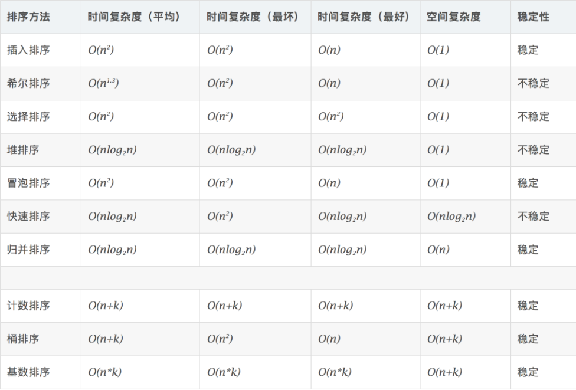

# 排序算法



[参考网址](https://www.cnblogs.com/onepixel/articles/7674659.html)


##  冒泡排序

冒泡排序是一种简单的排序算法。它重复地走访过要排序的数列，一次比较两个元素，如果它们的顺序错误就把它们交换过来。走访数列的工作是重复地进行直到没有再需要交换，也就是说该数列已经排序完成。这个算法的名字由来是因为越小的元素会经由交换慢慢“浮”到数列的顶端。 

### 算法描述

+ 比较相邻的元素。如果第一个比第二个大，就交换它们两个；
+ 对每一对相邻元素作同样的工作，从开始第一对到结尾的最后一对，这样在最后的元素应该会是最大的数；
+ 针对所有的元素重复以上的步骤，除了最后一个；
+ 重复步骤1~3，直到排序完成。
+ 

### 算法实现

```c++
//冒泡排序
void BubbleSort(vector<int>& list)
{
	for (int i = 0;i < list.size() - 1;i++)
	{
		for (int j = 0;j < list.size() - i - 1;j++)
		{
			int temp = list[j];
			if (list[j] > list[j + 1])
			{
				list[j] = list[j + 1];
				list[j + 1] = temp;
			}
		}
	}
}
```


## 选择排序

选择排序(Selection-sort)是一种简单直观的排序算法。它的工作原理：首先在未排序序列中找到最小（大）元素，存放到排序序列的起始位置，然后，再从剩余未排序元素中继续寻找最小（大）元素，然后放到已排序序列的末尾。以此类推，直到所有元素均排序完毕。 

### 算法描述

+ 初始状态：无序区为R[1..n]，有序区为空；
+ 第i趟排序(i=1,2,3…n-1)开始时，当前有序区和无序区分别为R[1..i-1]和R(i..n）。该趟排序从当前无序区中-选出关键字最小的记录 R[k]，将它与无序区的第1个记录R交换，使R[1..i]和R[i+1..n)分别变为记录个数增加1个的新有序区和记录个数减少1个的新无序区；
+ n-1趟结束，数组有序化了。
+ 

### 算法实现

```c++
void SelectionSort(vector<int>& list)
{
	for (int i = 0;i < list.size() - 1;i++)
	{
		int id = i;
		for (int j = i;j < list.size();j++)
		{
			if (list[j] < list[id])id = j;
		}
		int temp = list[i];
		list[i] = list[id];
		list[id] = temp;
	}
}
```


## 插入排序

插入排序（Insertion-Sort）的算法描述是一种简单直观的排序算法。它的工作原理是通过构建有序序列，对于未排序数据，在已排序序列中从后向前扫描，找到相应位置并插入。

### 算法描述

+ 从第一个元素开始，该元素可以认为已经被排序；

+ 取出下一个元素，在已经排序的元素序列中从后向前扫描；

+ 如果该元素（已排序）大于新元素，将该元素移到下一位置；

+ 重复步骤3，直到找到已排序的元素小于或者等于新元素的位置；

+ 将新元素插入到该位置后；

+ 重复步骤2~5。

  

### 算法实现

```c++
//插入排序
void InsertSort(vector<int>& list)
{
	if (list.size() <= 1)return;

	for (int i = 0;i < list.size() - 1;i++)
	{
		for (int j = i + 1;j >= 1;j--)
		{
			if (list[j] < list[j - 1])
			{
				int temp = list[j];
				list[j] = list[j - 1];
				list[j - 1] = temp;
			}
		}
	}
}
```


## 希尔排序（:star:）

1959年Shell发明，第一个突破O(n^2^)的排序算法，是简单插入排序的改进版。它与插入排序的不同之处在于，它会优先比较距离较远的元素。希尔排序又叫**缩小增量排序**。

### 算法描述

+ 选择一个增量序列t1，t2，…，tk，其中ti>tj，tk=1；
+ 按增量序列个数k，对序列进行k 趟排序；
+ 每趟排序，根据对应的增量ti，将待排序列分割成若干长度为m 的子序列，分别对各子表进行直接插入排序。仅增量因子为1 时，整个序列作为一个表来处理，表长度即为整个序列的长度。
+ 

### 算法实现

```c++
//希尔排序
void ShellSort(vector<int>& list)
{
	if (list.size() <= 1)return;
	for (int gap = list.size() / 2;gap > 0;gap = gap / 2)
	{
        // 注意：这里和动图演示的不一样，动图是分组执行，实际操作是多个分组交替执行
		for (int i = gap;i < list.size();i++)
		{
			int j = i;
			int temp = list[i];
			while (j - gap >= 0 && temp < list[j - gap])
			{
				list[j] = list[j - gap];
				j = j - gap;
			}
			list[j] = temp;
		}
	}
}
```


## 归并排序

归并排序是建立在归并操作上的一种有效的排序算法。该算法是采用分治法（Divide and Conquer）的一个非常典型的应用。将已有序的子序列合并，得到完全有序的序列；即先使每个子序列有序，再使子序列段间有序。若将两个有序表合并成一个有序表，称为2-路归并。 

### 算法描述

+ 把长度为n的输入序列分成两个长度为n/2的子序列；
+ 对这两个子序列分别采用归并排序；
+ 将两个排序好的子序列合并成一个最终的排序序列。
+ 

### 算法实现

```c++
void Merge(vector<int>& list, int head, int tail)
{
	int middle = (head + tail) / 2;
	vector<int> temp;
	int a = head;
	int b = middle + 1;

	while (a <= middle && b <= tail)
	{
		if (list[a] <= list[b])
		{
			temp.push_back(list[a]);
			a++;
		}
		else {
			temp.push_back(list[b]);
			b++;
		}
	}

	while (a <= middle)
	{
		temp.push_back(list[a]);
		a++;
	}

	while (b <= tail)
	{
		temp.push_back(list[b]);
		b++;
	}

	for (int i = 0;i <= tail - head;i++)
	{
		list[head + i] = temp[i];
	}

}

//归并排序
void MergeSort(vector<int>& list,int head,int tail)
{
	if (head >= tail)return;
	int middle = (head + tail) / 2;
	MergeSort(list, head, middle);
	MergeSort(list, middle + 1, tail);
	Merge(list, head, tail);
}
```


## 快速排序

快速排序的基本思想：通过一趟排序将待排记录分隔成独立的两部分，其中一部分记录的关键字均比另一部分的关键字小，则可分别对这两部分记录继续进行排序，以达到整个序列有序。

### 算法描述

+ 从数列中挑出一个元素，称为 “基准”（pivot）；

+ 重新排序数列，所有元素比基准值小的摆放在基准前面，所有元素比基准值大的摆在基准的后面（相同的数可以到任一边）。在这个分区退出之后，该基准就处于数列的中间位置。这个称为分区（partition）操作；

+ 递归地（recursive）把小于基准值元素的子数列和大于基准值元素的子数列排序。

  

### 算法实现

```c++
void QuickSort(vector<int>& list, int head, int tail)
{
	if (head >= tail)return;

	int pivot = tail; //基准这里直接设置为末尾元素
	int a = -1;

	for (int i = 0;i <= tail - 1;i++)
	{
		if (list[i] < list[pivot])
		{
			SwapByIndex(list, i, ++a);
		}
	}

	SwapByIndex(list, ++a, pivot);
	QuickSort(list, head, a - 1);
	QuickSort(list, a + 1, tail);
}
```


## 堆排序（:star:）

堆排序（Heap sort）是指利用堆这种数据结构所设计的一种排序算法。堆积是一个近似完全二叉树的结构，并同时满足堆积的性质：即子结点的键值或索引总是小于（或者大于）它的父节点。

> 复习：
>
> 完全二叉树：一棵深度为k的有n个结点的[二叉树](https://baike.baidu.com/item/二叉树/1602879)，对树中的结点按从上至下、从左到右的顺序进行编号，如果编号为i（1≤i≤n）的结点与[满二叉树](https://baike.baidu.com/item/满二叉树/7773283)中编号为i的结点在二叉树中的位置相同，则这棵二叉树称为完全二叉树。
>
> 最大堆：最大（小）堆是指在树中，存在一个结点而且该结点有儿子结点，该结点的data域值都不小于（大于）其儿子结点的data域值，并且它是一个完全二叉树（不是满二叉树）。
>
> [最大堆参考博客](https://www.jianshu.com/p/21bef3fc3030)

### 算法描述

+ 将初始待排序关键字序列(R1,R2….Rn)构建成大顶堆，此堆为初始的无序区；
+ 将堆顶元素R[1]与最后一个元素R[n]交换，此时得到新的无序区(R1,R2,……Rn-1)和新的有序区(Rn),且满足R[1,2…n-1]<=R[n]；
+ 由于交换后新的堆顶R[1]可能违反堆的性质，因此需要对当前无序区(R1,R2,……Rn-1)调整为新堆，然后再次将R[1]与无序区最后一个元素交换，得到新的无序区(R1,R2….Rn-2)和新的有序区(Rn-1,Rn)。不断重复此过程直到有序区的元素个数为n-1，则整个排序过程完成。
+ 

### 算法实现

```c++
//堆排序：构建最大堆，然后不断剔除根节点（通过交换此时堆中末尾节点和根节点）。
void Heapify(vector<int>& list, int root,int length)
{
	int left = 2 * root + 1;
	int right = 2 * root + 2;
	int largest = root;
	int len = length;

	if (left<len && list[left] > list[largest])
	{
		largest = left;
	}

	if (right<len && list[right]>list[largest])
	{
		largest = right;
	}

	if (largest != root)
	{
		SwapByIndex(list, root, largest);
		Heapify(list, largest,len);
	}
}
void HeapSort(vector<int>& list)
{
	int len = list.size();
	for (int i = list.size() / 2;i >= 0;i--)
	{
		Heapify(list, 0, len);
	}
	for (int i = list.size() - 1;i > 0;i--)
	{
		SwapByIndex(list, 0, i);
		len--;
		Heapify(list, 0, len);
	}

}
```


## 计数排序

计数排序不是基于比较的排序算法，其核心在于将输入的数据值转化为键存储在额外开辟的数组空间中。 作为一种线性时间复杂度的排序，计数排序要求输入的数据必须是有确定范围的整数。

### 算法描述

+ 找出待排序的数组中最大和最小的元素；

+ 统计数组中每个值为i的元素出现的次数，存入数组C的第i项；

+ 对所有的计数累加（从C中的第一个元素开始，每一项和前一项相加）；

+ 反向填充目标数组：将每个元素i放在新数组的第C(i)项，每放一个元素就将C(i)减去1。

  

### 算法实现

```c++
//计数排序
void CountingSort(vector<int>& list)
{
	array<int, 10000> box = {0};
	for (int i = 0;i < list.size();i++)
	{
		box[list[i]]++;
	}

	int j = 0;
	for (int i = 0;i < box.size();i++)
	{
		while (box[i]-- > 0)list[j++] = i;
	}
}
```


## 桶排序

桶排序是计数排序的升级版。它利用了函数的映射关系，高效与否的关键就在于这个映射函数的确定。桶排序 (Bucket sort)的工作的原理：假设输入数据服从均匀分布，将数据分到有限数量的桶里，每个桶再分别排序（有可能再使用别的排序算法或是以递归方式继续使用桶排序进行排）

### 算法描述

+ 设置一个定量的数组当作空桶；
+ 遍历输入数据，并且把数据一个一个放到对应的桶里去；
+ 对每个不是空的桶进行排序；
+ 从不是空的桶里把排好序的数据拼接起来。 

### 算法实现

```c++
//桶排序，默认桶数是3
#define BUCKET_NUM 3
void BucketSort(vector<int>& list)
{
	int max = list[0], min = list[0];
	for (int i = 0;i < list.size();i++)
	{
		if (list[i] > max)max = list[i];
		if (list[i] < min)min = list[i];
	}
	int level = (max - min) / BUCKET_NUM;

	array<vector<int>, BUCKET_NUM> buckets;
	for (int i = 0;i < list.size();i++)
	{
		int index = (list[i] - min) / level;
		if (index >= BUCKET_NUM)index = BUCKET_NUM - 1;
		buckets[index].push_back(list[i]);
	}
    
	for (int i = 0;i < BUCKET_NUM;i++)
	{
		CountingSort(buckets[i]);
	}
    
	for (int i = 1;i < BUCKET_NUM;i++)
	{
		buckets[0].insert(buckets[0].end(), buckets[i].begin(), buckets[i].end());
	}

	list = buckets[0];
}
```


## 基数排序

基数排序是按照低位先排序，然后收集；再按照高位排序，然后再收集；依次类推，直到最高位。有时候有些属性是有优先级顺序的，先按低优先级排序，再按高优先级排序。最后的次序就是高优先级高的在前，高优先级相同的低优先级高的在前。

### 算法描述

+ 取得数组中的最大数，并取得位数；
+ arr为原始数组，从最低位开始取每个位组成radix数组；
+ 对radix进行计数排序（利用计数排序适用于小范围数的特点）；
+ 

### 算法实现

```c++
//基数排序
#define RADIX 10
void RadixSort(vector<int>& list)
{
	int max = list[0];
	for (int i = 0;i < list.size();i++)
	{
		if (list[i] > max)max = list[i];
	}

	int b_num = 0,temp = max;

	while (temp > 0) {
		temp = temp / RADIX;
		b_num++;
	}

	array<vector<int>, RADIX> buckets;

	int d = 1;
	for (int i = 0;i < b_num;i++)
	{
		for (int j = 0;j < list.size();j++)
		{
			int a = (list[j] / d) % RADIX;
			buckets[a].push_back(list[j]);
		}

		for (int i = 1;i < RADIX;i++)
		{
			buckets[0].insert(buckets[0].end(), buckets[i].begin(), buckets[i].end());
		}

		list = buckets[0];

		for (int i = 0;i < RADIX;i++)buckets[i].clear();

		d *= RADIX;
	}
}
```

