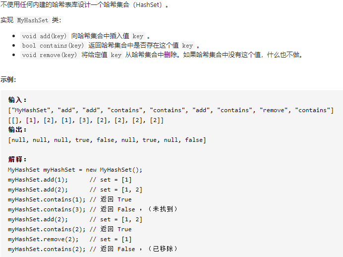

## 705 设计哈希集合:star:



```c++
class MyHashSet {
public:
    int HashSet[6000];
	int EmptySet[6000];
	int zs = 89;
	int num = 0;
	/** Initialize your data structure here. */
	MyHashSet() {
		for (int i = 0;i < 6000;i++)
		{
            HashSet[i] = INT_MIN;
            EmptySet[i] = 0;
        }

	}

	void add(int key) {
		int pos = key % zs;
		int i = 1;
		while (EmptySet[pos] != 0 && HashSet[pos] != key)
		{
			pos += i;
			pos = pos % 6000;
			i++;
		}
		if (EmptySet[pos] == 0)
		{
			HashSet[pos] = key;
			EmptySet[pos] = 1;
			num++;
		}
	}

	void remove(int key) {
		int pos = key % zs;
		int i = 1;
		while (HashSet[pos] != key && i <= num + 1)
		{
			pos += i;
			pos = pos % 6000;
			i++;
		}
        if(HashSet[pos] == key)
        {
            HashSet[pos] = INT_MIN;
		    EmptySet[pos] = 0;
		    num--;
        }
	}

	/** Returns true if this set contains the specified element */
	bool contains(int key) {
		int pos = key % zs;
		int i = 1;
		while (HashSet[pos] != key && i <= num + 1)
		{
			pos += i;
			pos = pos % 6000;
			i++;
		}
        //cout<<key<<"  "<<pos<<endl;
		if (HashSet[pos] != key)return false;
		else return true;

	}
};

/**
 * Your MyHashSet object will be instantiated and called as such:
 * MyHashSet* obj = new MyHashSet();
 * obj->add(key);
 * obj->remove(key);
 * bool param_3 = obj->contains(key);
 */
```

核心思路：[哈希](https://blog.csdn.net/gebushuaidanhenhuai/article/details/70239218)