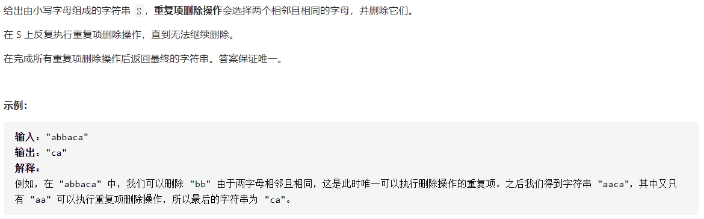

## 232 用栈实现队列:star:


```c++
class MyQueue {
public:

	stack<int> a;
	stack<int> b;

	/** Initialize your data structure here. */
	MyQueue() {
	
	}

	/** Push element x to the back of queue. */
	void push(int x) {
		a.push(x);
	}

	/** Removes the element from in front of queue and returns that element. */
	int pop() {
		while (!a.empty())
		{
			b.push(a.top());
			a.pop();
		}
		int result = b.top();
		b.pop();
		
		while (!b.empty())
		{
			a.push(b.top());
			b.pop();
		}
		return result;
	}

	/** Get the front element. */
	int peek() {
		while (!a.empty())
		{
			b.push(a.top());
			a.pop();
		}
		int result = b.top();

		while (!b.empty())
		{
			a.push(b.top());
			b.pop();
		}
		return result;
	}

	/** Returns whether the queue is empty. */
	bool empty() {
		return a.empty();
	}
};
```

核心思路：左栈倒右栈，左栈的栈尾到了右栈的栈头


## 503 下一个更大的元素II:star::star:


```c++
class Solution {
public:
    vector<int> nextGreaterElements(vector<int>& nums) {
        if(nums.size() == 0)return {};
        if(nums.size() == 1)return {-1};
		stack<int> value;
		stack<int> pos;
		vector<int> result(nums.size(), -1);
		for (int i = 0;i < nums.size() * 2;i++)
		{
			int temp = nums[(i + 1) % nums.size()] - nums[i % nums.size()];

			if (temp > 0)
			{
				if(result[i % nums.size()] == -1)result[i % nums.size()] = nums[(i + 1) % nums.size()];
				while (temp != 0 && !value.empty())
				{
					int a = value.top() + temp;
					if (a <= 0)
					{
						value.pop();
						value.push(a);
						temp = 0;
					}
					else {
						value.pop();
						if(result[pos.top()] == -1)result[pos.top()] = nums[(i + 1) % nums.size()];
						pos.pop();
						temp = a;
					}
				}
			}
			else
			{
				value.push(temp);
				pos.push(i % nums.size());
			}
		}
		return result;
	}
};
```

核心思路：首先将数组转化为临差数组，例如：


然后，遍历这个数组两次，让其首尾相连：


每次，遇见负数，将其值和位置压入栈；遇见非负数，则弹出栈顶元素，根据相加的结果进行判断，如果大于零，则确认了栈顶元素的`第一更大值`，然后将其出栈，并将这个值和新的栈顶元素进行这个判断；如果小于零，则将这个值更新栈顶元素，并设置求和值为0（即跳出循环）。


## 1047 删除字符串中的所有相邻重复项:star:



```c++
class Solution {
public:
    string removeDuplicates(string S) {
        if (S.length() <= 1)return S;

        S = S + '@';

		stack<char> st;

		for (int i = 0;i < S.length() - 1;i++)
		{
			if (S[i] == S[i + 1])
				i++;
			else
			{
				if (!st.empty() && st.top() == S[i])
				{
					st.pop();
				}
				else
				{
					st.push(S[i]);
				}
			}
		}

		string result;

		while (!st.empty())
		{
			result += st.top();
			st.pop();
		}

		reverse(result.begin(), result.end());
		
		return result;
    }
};
```

核心思路：每次判断两个字符，如果一样，则额外`i++`，跳过后一个字符；如果不一样，比较第一个字符和栈顶字符，一样，则弹出栈顶元素，不一样则将第一个字符压栈。

