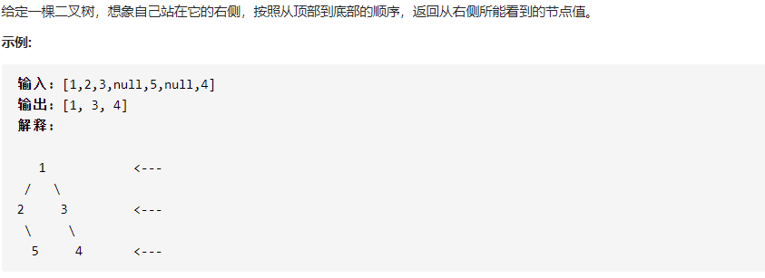

## 199. 二叉树的右视图



```c++
class Solution {
public:
    void Search(TreeNode* tree, vector<int>& a, int n)
	{
		if (a.size() <= n)a.push_back(tree->val);
		if(tree->right!=nullptr)
			Search(tree->right, a, n + 1);
		if (tree->left != nullptr)
			Search(tree->left, a, n + 1);
	}

	vector<int> rightSideView(TreeNode* root) {
		vector<int> r;
        if(root == nullptr)return r;
		Search(root, r, 0);
		return r;
	}
};
```

核心思路：始终优先遍历右子树。