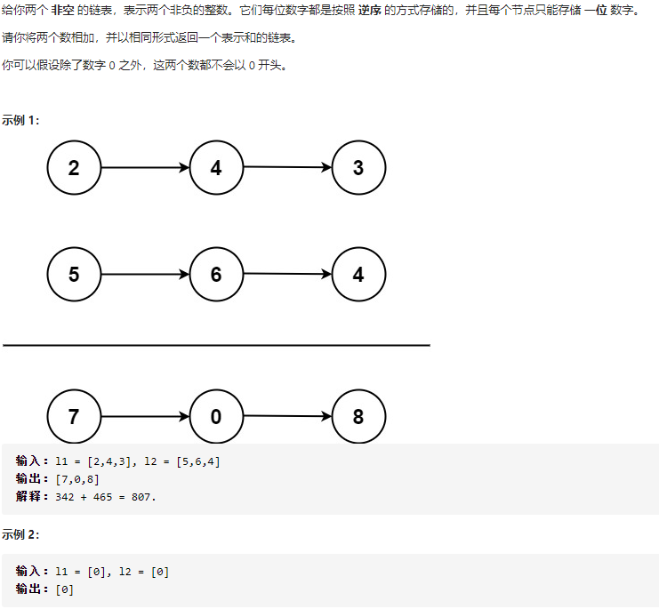

## 2 两数相加:star::star:



```c++
class Solution {
public:
    ListNode* addTwoNumbers(ListNode* l1, ListNode* l2) {
        ListNode* head = l1, *tail;
		int a = 0, b = 0;
		while (l1 != nullptr || l2!=nullptr)
		{
			b = a;
            a = 0;
			if (l2 != nullptr)
			{
				a = (b + l2->val) / 10;
				b = (b + l2->val) % 10;
				l2 = l2->next;
			}
			if (l1 != nullptr)
			{
				a = a + (b + l1->val) / 10;
				b = (b + l1->val) % 10;
				tail = l1;
				l1->val = b;
				l1 = l1->next;
			}
			else {
				ListNode* c = new ListNode();
				c->val = b;
				tail->next = c;
				tail = c;
			}
		}
		if (a != 0)
		{
			ListNode* c = new ListNode();
			c->val = a;
			tail->next = c;
		}
		return head;
    }
};
```

核心思路：遍历链表，将值存入链表。


## 25. K个一组翻转列表:star::star::star:


```c++
class Solution {
public:
    void Surf(ListNode* &a, int k)
	{
		if (k == 0)return;
		Surf(a->next, k - 1);
		a->next->next = a;
	}

    ListNode* reverseKGroup(ListNode* head, int k) {
		int L = k;
        ListNode* temp = new ListNode;
		temp->next = head;
        ListNode* h1= temp;
		while (head != nullptr)
		{
			L--;
            //每k个开始翻转
			if (L == 0)
			{
                //翻转区域的下一跳
				ListNode* a = head->next;
                //翻转区域的起点
				ListNode* b = temp->next;
                //递归翻转
				Surf(b, k - 1);
                //区域的起点指向 原本区域的下一跳
				b->next = a;
                //上一段区域 指向原本区域的终点
				temp->next = head;
                //更新 上一段区域的终点
				temp = b;
				L = k;
                //由于翻转了，所以更新head
                head = a;
                continue;
			}
			head = head->next;
		}
		return h1->next;
    }
};
```

核心思路：具体见注释。


## 206. 反转链表:star:


```c++
class Solution {
public:
    
	ListNode* Surf2(ListNode* a)
	{
		if (a->next == nullptr)
		{
			return a;
		}
		ListNode* c = Surf2(a->next);
		a->next->next = a;
        return c;
	}

	ListNode* reverseList(ListNode* head) {
        if(head == nullptr)return nullptr;
        ListNode* b = head;
		ListNode* p = Surf2(head);
        b->next = nullptr;
		return p;
	}
};
```

核心思路：递归，注意**终点节点**的下一跳要置`nullptr`


## 21. 合并两个有序链表:star:


```c++
class Solution {
public:
    ListNode* mergeTwoLists(ListNode* l1, ListNode* l2) {
        ListNode* head = new ListNode;
		ListNode* p = head;
        head->next = nullptr;

		while (l1 != nullptr || l2 != nullptr)
		{
			if (l1 != nullptr && l2 != nullptr)
			{
				if (l1->val > l2->val)
				{
					p->next = l2;
					l2 = l2->next;
				}
				else {
					p->next = l1;
					l1 = l1->next;
				}
			}
			else if (l1 != nullptr)
			{
				p->next = l1;
				l1 = l1->next;
			}
			else
			{
				p->next = l2;
				l2 = l2->next;
			}
			p = p->next;
		}
		return head->next;
    }
};
```

核心思路：正常插。


