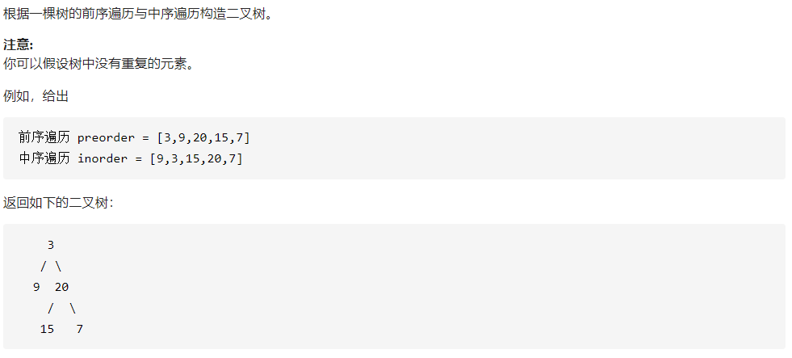

# DFS算法

## 338 比特位计算 :star::star:


```c++
vector<int> countBits(int num) {
    vector<int> bit_array;
    vector<int> result(num + 1,0);
    int temp = num;

    while (temp > 0)
    {
            bit_array.push_back(temp % 2);
            temp = temp / 2;
    }

    int one_number = 0;

    for (int i = 0;i < num;i++)
    {
            one_number = 0;

            for (int j = 0;j < bit_array.size();j++)
            {
                if (bit_array[j] == 1)one_number++;
            }
            result[num - i] = one_number;

            int pos = 0;

            while (bit_array[pos] != 1)
            {
                bit_array[pos] = 1;
                pos++;
            }

            bit_array[pos] = 0;
    }

    return result;
}
```

核心思想：首先获取最高数的每位情况，然后每次从起点开始，遇见0变1，直到第一个1，将其变为0，截止，然后计算1的数量，重复这个过程。

来自大佬的方法：


## 98 验证二叉搜索树:star::star:❓️


```c++
 double last = (double)INT_MIN-1;
 bool isValidBST(TreeNode* root) {
     if (root == NULL) {
    	 return true;
     }
     if (isValidBST(root->left)) {
         if (last < root->val) {
             last = root->val;
             return isValidBST(root->right);
         }
     }
     return false;
 }
```

核心思路 ：妈的，脑子不转了，其实就是简单的==中序遍历==。


##  105 从前序与中序遍历序列构造二叉树 :star::star:



```c++
TreeNode* buildTree(vector<int>& preorder, vector<int>& inorder) {
    if (preorder.size() == 0)return NULL;
    TreeNode* root = new TreeNode(preorder[0]);
    vector<int> La, Lb, Ra, Rb;
    int pos = -1;
    for (int i = 0;i < inorder.size();i++)
    {
        if (inorder[i] == preorder[0]) {
            pos = i;
            break;
   		}
   	 	La.push_back(inorder[i]);
    }

    for (int i = pos + 1;i < inorder.size();i++)
    {
    	Lb.push_back(inorder[i]);
    }

    for (int i = 1;i < 1 + pos;i++)
    {
    	Ra.push_back(preorder[i]);
    }

    for (int i = 1 + pos;i < preorder.size();i++)
    {
    	Rb.push_back(preorder[i]);
    }

    root->left = buildTree(Ra, La);
    root->right = buildTree(Rb, Lb);
    return root;
}
```

核心思路：递归造树，前序的第一个元素肯定是根节点，而该元素在中序遍历中的位置的左边，则是该节点的左子树的所有成员，对应的则是前序遍历第一个元素之后的相应数量的成员，两者组成左子树的前序和中序，而其余的组成右子树的前序和中序，递归这个过程。


