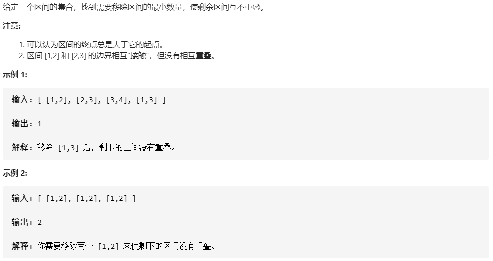

## 983 数组形式的整数加法:star:


```c++
class Solution {
public:
    vector<int> addToArrayForm(vector<int>& A, int K) {
        int add = 0;
        int pos = 0;
        int len = A.size();
        reverse(A.begin(), A.end());

        while (K > 0 && pos < len)
        {
            int a = K % 10;
            int temp = A[pos] + a + add;
            A[pos] = temp % 10;
            add = temp / 10;
            K = K / 10;
            pos++;
        }

        while (K > 0)
        {
            A.push_back((add + K % 10) % 10);
            add = (add + K % 10) / 10;
            K = K / 10;
        }

        while (pos < len)
        {
            int temp = A[pos] + add;
            A[pos] = temp % 10;
            add = temp / 10;
            pos++;
        }

        if(add > 0)A.push_back(add);

        reverse(A.begin(), A.end());
        
        return A;
    }
};
```


## 55 跳跃游戏:star::star:


```c
class Solution {
public:
    bool canJump(vector<int>& nums) {
        if(nums.size() == 1)return true;
        int max_step = 0;
        for (int i = 0;i < nums.size();i++)
        {
            if (nums[i] == 0 && max_step <= i && i != nums.size() - 1)return false;
            if (i + nums[i] > max_step)max_step = i + nums[i];
        }
        return true;
    }
};
```


解题思路：要明确题目隐含的规则——只要能够通过0，就必然可以到达终点


## 134 加油站:star::star:


```c++
class Solution {
public:
    int canCompleteCircuit(vector<int>& gas, vector<int>& cost) {
        int len = cost.size();
        int pos = -1;
        int temp = 0;
        vector<int> piece_sum;

        for (int i = 0;i < len;i++)
        {
            gas[i] = gas[i] - cost[i];

            if (gas[i] >= 0 && temp == 0)
            {
                pos = i;
            }

            temp += gas[i];
            if (temp < 0)
            {
                piece_sum.push_back(temp);
                temp = 0;
            }
        }
        
        for (int i = 0;i < piece_sum.size();i++)
        {
            temp += piece_sum[i];
            if (i != piece_sum.size() && temp < 0)return -1;
        }

        return pos;
    }
};
```


解题思路：总体思路是，在进行数组遍历的时候，单独的负节点作为一个`Piece`存储起来；以正节点为起点，到达某一个节点时，整个分段之和小于0的，已经失去了作为起点的资格，其和也作为`Piece`存储起来。以唯一的一个正分路（当然，可能没有），和之前的Piece依次相加，如果小于0，则视为没有答案（最后一个"Piece"不用相加，根据此题的性质）


## 316 去除重复字母:star::star:❓️


```c++
class Solution {
public:
    string removeDuplicateLetters(string s) {

       vector<int> vis(26), num(26);
        for (char ch : s) {
            num[ch - 'a']++;
        }

        string stk;
        for (char ch : s) {
            if (!vis[ch - 'a']) {
                while (!stk.empty() && stk.back() > ch) {
                    if (num[stk.back() - 'a'] > 0) {
                        vis[stk.back() - 'a'] = 0;
                        stk.pop_back();
                    } else {
                        break;
                    }
                }
                vis[ch - 'a'] = 1;
                stk.push_back(ch);
            }
            num[ch - 'a'] -= 1;
        }
        return stk;
    }
};
```


## 376 摆动序列:star::star:


```c++
int wiggleMaxLength(vector<int>& nums) {

    if (nums.size() <= 1)return nums.size();

    int key = 0;
    int sum = 0;

    for (int i = 1;i < nums.size();i++)
    {
    	int temp = nums[i] - nums[i-1] > 0 ? 1 : nums[i] - nums[i-1] < 0 ? -1 : 0;

        if (temp == 0)
        {
        	sum++;
        }

        else if (temp * key > 0)
        {
        	sum++;
        }
        else
        {
        	key = temp;
        }
    }
    return nums.size() - sum;
}
```

核心思路：删去直线上的所有点。（哈哈，一开始思路是没错的，但是代码写错了，浪费了不少时间）


## 402 移掉K位数字:star::star:❓️


```c++
string removeKdigits(string num, int k) {
    if(k >= num.length())return "0";
    for(int i = 0;i < k;i++)
    {
        int pos=0;
        while(num[pos]<=num[pos+1])pos++;
        num.erase(pos,1);
        while(num.length() > 1 && num[0] == '0')num.erase(0,1);
    }
    return num;
}
```

核心思路：在字符串中找到第一个比自己左边字符大的位置，删去该字符，然后重复K次；需要注意的是，每次删除过后，需要清楚开头的0。


## 406 根据身高重建队列:star::star:


```c++
 vector<vector<int>> reconstructQueue(vector<vector<int>>& people) {

        if (people.size() <= 1)return people;
        int size = people.size();
        vector<vector<int>> result(1);

        int pos;

        for (int i = 0;i < size;i++)
        {
            pos = 0;
            vector<int>temp = people[pos];

            for (int j = 0;j < people.size();j++)
            {
                if (people[j][0] > temp[0] || (people[j][0] == temp[0] && people[j][1] < temp[1])) {
                    pos = j;
                    temp = people[pos];
                }
            }
            people.erase(people.begin() + pos, people.begin() + pos + 1);
            result.insert(result.begin()+temp[1],temp);
           
        }

        for(pos = result.size() - 1;pos >= 0;pos--)
        {
            if(result[pos].size() <= 1)break;
        }
        result.erase(result.begin() + pos,result.begin() + pos + 1);
        
        return result;
    }

```

核心思路：每次获得数组中，数值最大，前置数最小的项，根据它的前置数插入到数组的相应位置，比如将[7,2]插入到位置`2`，再将[7,3]插入到位置`3`.


## 435 无重叠区间:star::star:



```c++
int eraseOverlapIntervals(vector<vector<int>>& intervals) {
    if(intervals.size()<=1)return 0;

    vector<int> temp;
    int end = INT16_MIN;
    int min = INT16_MAX;
    int num = 0, pos = 0;

    for (int i = 0;i < intervals.size();i++)
    {
        min = INT16_MAX;
        for (int j = 0;j < intervals.size();j++)
        {
            if (intervals[j][0] < min) {
            min = intervals[j][0];
            temp = intervals[j];
            pos = j;
        	}
        }
        
        if (temp[0] >= end) end = temp[1];
        else if (temp[1] < end)
        {
            //终点更新
            end = temp[1];
            num++;
        }
        else
        {
        	num++;
        } 

        intervals[pos][0] = INT16_MAX;
    }
    return num;
}
```

核心思路：每次选取数组中起点最小的项，和已经得到的终点（初始是==INT16_MIN==）进行比较，如果大于它则继续，否则进行进一步判断：如果此项的终点大于现有终点，则直接计数加一，否则还要进行终点更新。